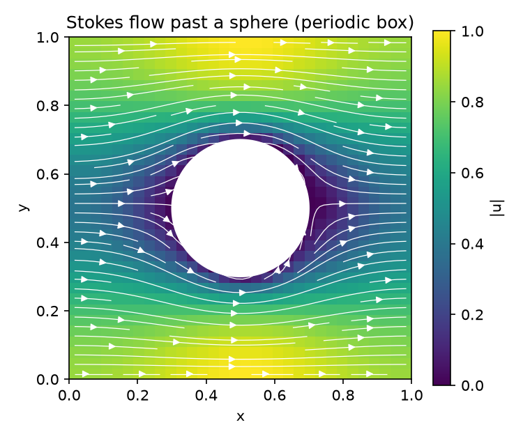

# Peclet

[](https://pypi.org/project/peclet/)
[](https://pypi.org/project/peclet/)
[](LICENSE)
[](https://computational-chemical-engineering.github.io/peclet/)
[](https://github.com/computational-chemical-engineering/peclet/actions/workflows/site.yml)
[](https://doi.org/10.5281/zenodo.21132445)

A suite of codes for **simulation of transport phenomena** — Eulerian (CFD/Navier–Stokes), Lagrangian
(DEM/particle packing) and mixed (Voronoi) methods — sharing one MPI **block domain decomposition**
with efficient **asynchronous ghost-layer exchange**, **SDF**-described solids, a common **immersed
boundary** methodology, **GPU** support, and **Python bindings**.

The name nods to the [Péclet number](https://en.wikipedia.org/wiki/P%C3%A9clet_number) — the ratio of
advective to diffusive transport, the dimensionless heart of transport phenomena.

🎬 **The 1.0.0 release film** — seven minutes on what the suite does and the evidence for it:

<a href="https://www.youtube.com/watch?v=L_uAHnL6Gq8">
  
</a>

More on the channel **[@PecletHPC](https://www.youtube.com/@PecletHPC)**: a short movie for every
worked example that has one, each linking back to the page with its code and numbers.

📖 **Documentation site:** <https://computational-chemical-engineering.github.io/peclet/> — the suite's front
door (Python API reference, install/deployment guide, design docs, links to each code's Doxygen API).
Built from `docs/` via MkDocs ([mkdocs.yml](mkdocs.yml)).

🧪 **Examples gallery:** <https://computational-chemical-engineering.github.io/peclet-examples/> — runnable,
validated notebooks (single-phase and two-phase flow, packings, DEM, CFD-DEM, scaling benchmarks), each
with an *Open in Colab* button.

This is an **umbrella repository**: each code is a git **submodule** (its own repo and history); this
repo pins compatible commits and holds the shared design docs.

## Clone

```bash
git clone --recursive git@github.com:computational-chemical-engineering/peclet.git
# or, after a plain clone:
git submodule update --init --recursive
```

## Layout

| Submodule | Role |
|-----------|------|
| `core/` | **Shared infrastructure** (header-only C++20 + MPI, optional Kokkos): ORB block decomposition, async grid ghost-layer exchange + Lagrangian particle migration/ghosts, SDF geometry, VTI I/O. Every method depends on it. |
| `flow/` | Eulerian **Kokkos** incompressible Navier–Stokes (porous media; staggered MAC grid + cut-cell IBM). Complete, validated, MPI-optional distributed solver on `core`. |
| `pnm/` | **Kokkos** pore-network extraction from SDF geometry (pores, watershed segmentation, throat topology). Split out of `flow`. |
| `dem/` | Lagrangian **Kokkos + ArborX** DEM/XPBD particle packing. Full XPBD step with a validated distributed `step_mpi` (core particle halo). |
| `voro/` | Mixed Lagrangian/Eulerian dynamic 3D Voronoi tessellation (**Kokkos** device tessellator; periodic & Lees–Edwards), mesh generator and Navier–Stokes on the Voronoi mesh. |
| `coupling/` | **CFD-DEM coupling** of `flow` + `dem` (Kokkos kernels + Python drivers): unresolved volume-averaged drag and resolved cut-cell coupling. |
| `morton/` | Morton/Z-order spatial-index primitive — arithmetic directly in Morton space (header-only C++17 + BMI2/AVX-512, Python). |

The compute codes are **Kokkos**-based; the same source runs on CUDA, HIP (AMD/LUMI), and OpenMP backends,
chosen by the bootstrapped install prefix (`tools/bootstrap_deps.sh`). The reusable parts of the original
`block_decomposer` prototype were extracted into `core/`.

## Shared design docs

`docs/` is the cross-code contract every method follows:
[ARCHITECTURE](docs/ARCHITECTURE.md) · [CONVENTIONS](docs/CONVENTIONS.md) · [STYLE](docs/STYLE.md) ·
[INTERFACES](docs/INTERFACES.md) · [ROADMAP](docs/ROADMAP.md) ·
[PORTABILITY](docs/PORTABILITY.md). See `CLAUDE.md` for an agent-facing overview.

## Install & run (Python)

Everything ships under one **`peclet` namespace** — installable parts of one family:

| PyPI package | Import | Role |
|---|---|---|
| `peclet-morton` | `peclet.morton` | Morton/Z-order spatial index |
| `peclet-flow` | `peclet.flow` | Eulerian incompressible Navier–Stokes solver |
| `peclet-pnm` | `peclet.pnm` | Pore-network extraction from SDF geometry |
| `peclet-dem` | `peclet.dem` | Lagrangian DEM/XPBD particle packing |
| `peclet-voro` | `peclet.voro` | Dynamic Voronoi tessellation + mesh generator |
| `peclet-coupling` | `peclet.coupling` | CFD-DEM coupling drivers over flow + dem — sdist only (`peclet[cfd-dem]`) |
| `peclet-core` | `peclet.core` (`.mpi`, `.geom`) | Shared infra (particle halo, analytic-SDF scenes) — sdist only (`peclet[mpi]`) |
| `peclet-amr` | `peclet.amr` | Block-octree AMR + collocated cut-cell Navier–Stokes solver on it — **0.x, under development** (API may change between minors) — sdist only (`peclet[amr]`) |
| `peclet` | — | metapackage: `pip install peclet` pulls the CPU family |
| `peclet-cu13` | — | metapackage: `pip install peclet-cu13` pulls the CUDA family (`peclet-{flow,pnm,dem,voro}-cu13`) |

**Multicore CPU (OpenMP):** the compute packages ship **self-contained wheels** — `pip install peclet`
(or an individual `pip install peclet-flow`) just works and runs multi-threaded (`OMP_NUM_THREADS`).

**Quick start** — Stokes flow past a sphere in a box of side `L`, start to finish (about half a minute on two
cores); the problem is stated in your own units and `N` sets the resolution. Run it as is after
`pip install peclet matplotlib`, or open it as a notebook in Colab, whose first cell installs the wheels:

[](https://colab.research.google.com/github/computational-chemical-engineering/peclet/blob/main/docs/notebooks/quickstart_sphere.ipynb)

```python
import numpy as np
import peclet.flow as flow

# --- the physical problem, in any consistent unit system -------------------------------------
L, R = 1.0, 0.2              # side of the periodic box and radius of the sphere at its centre
rho, mu = 1.0, 0.1           # fluid density and viscosity
F = 1.0                      # driving pressure gradient along x (force per unit volume)
N = 48                       # cells per side: change this for a grid-refinement study

s = flow.Solver((N, N, N), extent=(L, L, L))                    # a periodic box: a cubic lattice of spheres
s.set_rho(rho); s.set_mu(mu); s.set_dt(1e3)                    # every input physical; a large dt marches
s.set_body_force((F, 0.0, 0.0))                                #   straight to the steady Stokes flow

x, y, z = s.cell_centers()                                     # the grid the solver laid inside the box
X, Y, Z = np.meshgrid(x, y, z, indexing="ij")
sdf = np.sqrt((X - L/2)**2 + (Y - L/2)**2 + (Z - L/2)**2) - R  # signed distance, < 0 inside the sphere
s.set_solid(sdf, cutcell_pressure=True)                        # no-slip cut-cell immersed boundary

u_prev = 0.0
for it in range(200):
    s.step()
    u_mean = s.get_u().mean()
    if it > 5 and abs(u_mean - u_prev) < 1e-5 * abs(u_mean):   # steady: the mean velocity has settled
        break
    u_prev = u_mean
u, v, w = s.get_u(), s.get_v(), s.get_w()                      # physical velocity, physical pressure
p = s.get_p()
k = mu * u.mean() / F                                          # Darcy permeability of the sphere lattice
print(f"{flow.execution_space}: N = {N}, {it + 1} steps, permeability k = {k:.5e}")

# --- a look at the flow: speed and streamlines on the mid-plane through the sphere ---------------
import matplotlib.pyplot as plt
c = N // 2
speed = np.hypot(u[:, :, c], v[:, :, c])
plt.figure(figsize=(5, 4.2))
plt.imshow(np.ma.masked_where(sdf[:, :, c] < 0, speed).T, origin="lower", cmap="viridis",
           extent=[0, L, 0, L])
plt.streamplot(x, y, u[:, :, c].T, v[:, :, c].T, color="w", density=1.2, linewidth=0.6)
plt.colorbar(label="|u|"); plt.title("Stokes flow past a sphere (periodic box)")
plt.xlabel("x"); plt.ylabel("y"); plt.tight_layout()
plt.show()
```

> [!WARNING]
> **Running this in a container? Bound the thread pool first.** Kokkos sizes its OpenMP pool from
> the CPUs it can *see*. Colab, Binder, Docker and a Slurm cgroup all normally show you the whole
> host while granting a fraction of it, so the default pool spin-waits itself to a standstill —
> measured on the wheel above, this 26-second solve did not finish in **15 minutes** on 2 CPUs of
> quota with 48 visible, and finished in **26.0 s** with the pool bounded. Before importing peclet:
>
> ```python
> import os
> os.environ.setdefault("OMP_NUM_THREADS", "2")   # or however many CPUs you were actually granted
> os.environ.setdefault("OMP_PROC_BIND", "false")
> ```
>
> The Colab notebook reads the real budget out of `/sys/fs/cgroup/cpu.max` and does this for you.
> On a workstation you do not need it: there, visible and granted are the same.



**Single NVIDIA GPU:** `pip install peclet-cu13` — CUDA wheels of the same family (only the NVIDIA driver is
needed; not alongside `peclet` in one venv).

**AMD/HIP and multi-rank MPI:** a wheel cannot carry an MPI ABI, so you build the packages from source
against a Kokkos prefix, or use a container. Because the backend (Serial / OpenMP / CUDA / HIP) is compiled
in, you build for your hardware — [**docs/DEPLOYMENT.md**](docs/DEPLOYMENT.md) is the guide: the backend×MPI
matrix, `pip install` recipes per environment, the Snellius site install (`tools/hpc/`), and the
**Apptainer containers** (GHCR, built by CI on every release) for Snellius (CUDA) and LUMI (HIP) in
[`containers/`](containers).

## Continuous integration & docs

Each submodule carries its own `.github/workflows/`: a **CI** workflow (build + test — `core` and `morton`
run full CPU/MPI suites; the Kokkos codes build the OpenMP host backend and run their single-rank suites),
a **Documentation** workflow that builds the Doxygen API docs and publishes them to that repo's GitHub
Pages, and a **Release** workflow that builds the sdist + CPU wheels (+ the CUDA wheel) and publishes them
to PyPI on a version tag. The umbrella adds the documentation site (`site.yml`), the metapackages
(`release.yml`) and the containers (`containers.yml`). The whole procedure is written down in
[docs/RELEASE.md](docs/RELEASE.md).

## Contributing & community

Contributions are welcome — see **[CONTRIBUTING.md](CONTRIBUTING.md)** for the submodule dev setup,
build/test, and PR flow. Participation is governed by the [Contributor Covenant](CODE_OF_CONDUCT.md).
Report security issues privately per the [Security Policy](SECURITY.md). Release history lives in the
[CHANGELOG](CHANGELOG.md).

## Citing

If you use Peclet in your research, please cite it. Each release is archived on Zenodo:

[](https://doi.org/10.5281/zenodo.21132445)

- **All versions (concept DOI):** [10.5281/zenodo.21132445](https://doi.org/10.5281/zenodo.21132445) — always resolves to the latest release; use this unless you need to pin an exact version.
- **A specific version:** the Zenodo record lists a version DOI per release, and each [GitHub release](https://github.com/computational-chemical-engineering/peclet/releases) links to its own.

Machine-readable metadata is in [CITATION.cff](CITATION.cff) — use GitHub's "Cite this repository"
button for ready-made BibTeX/APA.

## Note on submodule pins

This umbrella pins each submodule to a compatible commit on `main`. Update to the latest upstream with
`git submodule update --remote` followed by a commit here that bumps the pointers.
